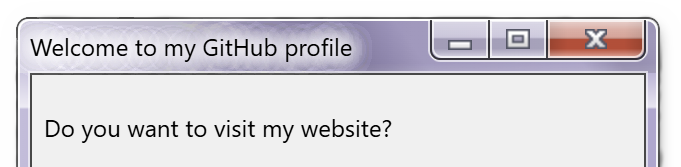
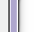

  <!-- Welcome Header -->
  
  
  

  <!-- Intro GIF -->
  

 

---

## 💫 About Me & 🚀 What I Do

<table border="0" width="100%">
  <tr>
    <td width="50%" valign="top">
      <h3>👋 Hi, I'm Krushnakant Patil</h3>
      
I'm a Computer Science undergraduate passionate about building innovative, clean, and scalable solutions through code.

      <ul>
        <li>✨ I specialize in <strong>full-stack development</strong>, creating modular tools, and contributing to open-source software.</li>
        <li>⚡ <strong>Fun Fact:</strong> I speak fluent C++ and broken JavaScripts.</li>
      </ul>
    </td>
    <td width="50%" valign="top">
      <h3>🛠️ What I Focus On</h3>
      <ul>
        <li>Full-stack development using modern web technologies</li>
        <li>Designing modular architectures and clean interfaces</li>
        <li>Automation, optimization, and clean code practices</li>
        <li>I joke about merge conflicts. I do not joke during merge conflicts. 😉</li>
      </ul>
      
🎯 <strong>Current Goal:</strong> Building modular tools and contributing to the open-source community.

    </td>
  </tr>
</table>

---

## 🌐 Connect with Me
  <!-- Retro Dialogue Widget -->
  

     <a target="_blank" href="https://krushnakantpatil.me/"
      ></a
    ><a
      href="https://youtu.be/dQw4w9WgXcQ?si=2mhHnsGbcQLij6I0"
      ></a
    > 
  

  

---

## 💻 Tech Stack

### 🔹 Languages
 
 
  
 
 
 
 
 
 
 
 

 

### 🔹 Frameworks & Libraries
 
 
 
 
 
 
 

 

### 🔹 Databases & Hosting
 
 
 
 

 

### 🔹 Data Science & Machine Learning
 
 
 

 

### 🔹 Tools & Design
 
 
 
 
 
 
 

---

## 📊 GitHub Analytics

  <table border="0" cellspacing="0" cellpadding="0">
    <tr align="center">
      <td>
        
      </td>
      <td>
        
      </td>
    </tr>
  </table>
   
  

  

